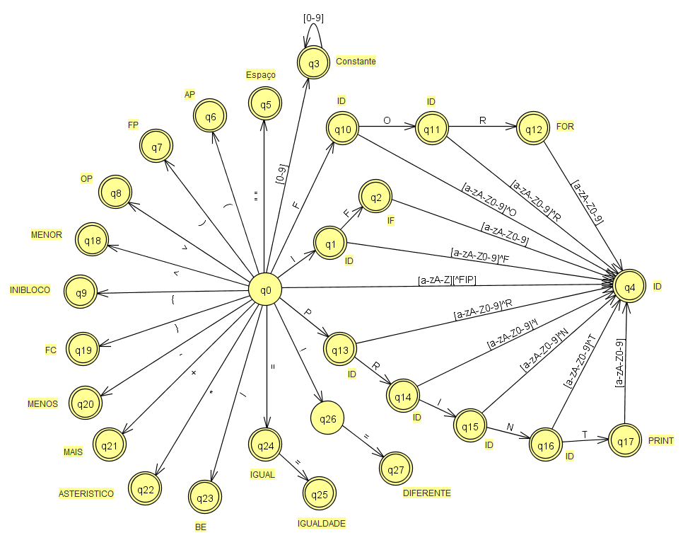

## Analizador léxico simples

Analizador léxico simples desenvolvido na matéria de compiladores

Identifica identificadores (variáveis), constantes e os seguintes tokens:
```
    IF
    FOR
    PRINT
    WHILE
    >
    <
    (
    )
    {
    }
    -
    +
    *
    /
    =
    ==
    !=
```

### Arquivos relacionados:
- [Formulário principal](Tokenlizer/Form1.cs)
- [Classe para armazenar um token](Tokenlizer/TokenClass.cs)
- [Tabelas de estados](Tokenlizer/TabelaEstados.cs)
- [Arquivo executável](Tokenlizer/bin/Debug/Tokenlizer.exe)

